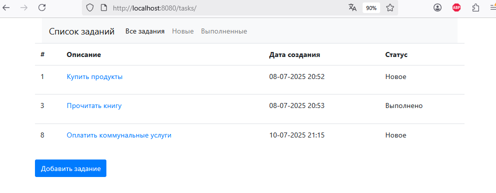
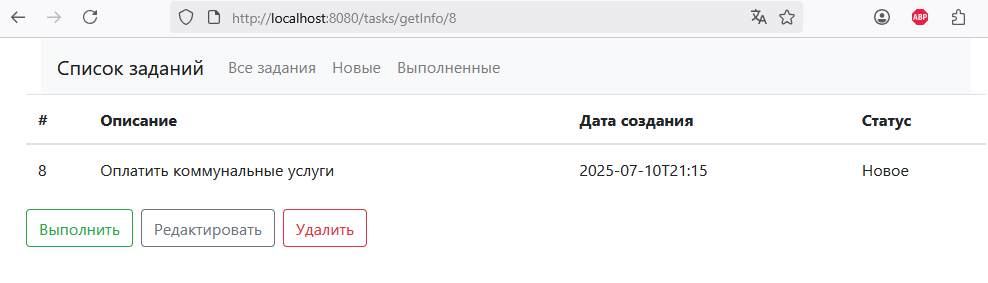

<html>
<h2>Приложение "Список задач"</h2>

<h3>О проекте</h3>

<h3> Описание:</h3>

Цель данного приложения - организация и планирование задач. 
На главной странице отображается список задач.
С помощью кнопки "Добавить" можно создать задание. Оно добавляется в список со статусом "Новое".
При нажатии на описание задания, происходит переход на страницу с подробным описанием, на ней доступны следующие действия:

- Выполнить - статус задания меняется на "Выполнено" 
- Редактировать - изменить описание задания 
- Удалить - удаляет задание из списка 

Скрин1:   

Скрин2:   

<h3>Технологии:</h3>
<b>Java 18</b> - версия языка программирования Java 
<b>Spring boot</b> - фреймворк для разработки приложений на языке Java 
<b>Liquibase</b> - инструмент для управления версиями базы данных и автоматизации процессов миграции схемы данных 
<b>JUnit</b> - фреймворк для модульного тестирования ПО 
<b>Maven</b> - это инструмент для автоматической сборки проектов 
<b>Tomcat</b> - контейнер сервлетов с открытым исходным кодом 
<b>Thymeleaf</b> -  шаблонизатор Java на стороне сервера 
<b>PostgreSQL</b> - объектно-реляционная СУБД 
<b>H2</b> - СУБД для тестирования 

<h3>Запуск проекта:</h3>
Скопируйте репозиторий 
Создайте базу данных в PostgreSQL 
Соберите и запустите проект 
Для доступа перейдите по адресу: <a href="http://localhost:8080/tasks">http://localhost:8080/tasks</a>

<h3>Контакты:</h3>
Telegram: <a href="https://t.me/AlexKrmv">https://t.me/AlexKrmv</a>

</html>